# 🏗️ Enhanced NL2SQL Agent - Architecture Diagram

## System Overview

```mermaid
graph TB
    %% User Interface Layer
    UI[🖥️ User Interface<br/>Web UI / Terminal / API]
    
    %% Orchestrator Layer
    OA[🎯 Orchestrator Agent<br/>Traffic Controller]
    
    %% Intent Detection Layer
    IDA[🧠 Intent Detection Agent<br/>Route to Right Workflow]
    
    %% Workflow Branching
    subgraph "Workflow Selection"
        NL2SQL[📊 NL2SQL Workflow]
        TONE[😊 Tone Analysis Workflow]
    end
    
    %% NL2SQL Flow
    subgraph "NL2SQL Pipeline"
        QUA[🔍 Query Understanding Agent]
        QGA[⚙️ Query Generation Agent]
        QRA[📝 Query Review Agent]
        QEA[🚀 Query Execution Agent]
    end
    
    %% Tone Analysis Flow
    subgraph "Tone Analysis Pipeline"
        CDA[📥 Conversation Data Agent]
        TAA[🎭 Tone Analysis Agent]
    end
    
    %% External Systems
    BQ[(🗄️ BigQuery<br/>Data Warehouse)]
    GEM[🤖 Gemini AI<br/>LLM Processing)]
    
    %% State Management
    STATE[💾 State Management<br/>Session Context]
    
    %% Connections
    UI --> OA
    OA --> IDA
    IDA --> NL2SQL
    IDA --> TONE
    
    %% NL2SQL Flow
    NL2SQL --> QUA
    QUA --> QGA
    QGA --> QRA
    QRA --> QEA
    QEA --> BQ
    
    %% Tone Analysis Flow
    TONE --> CDA
    CDA --> BQ
    CDA --> TAA
    TAA --> GEM
    
    %% State Connections
    OA -.-> STATE
    QUA -.-> STATE
    QGA -.-> STATE
    QRA -.-> STATE
    QEA -.-> STATE
    CDA -.-> STATE
    TAA -.-> STATE
    
    %% Styling
    classDef userInterface fill:#e1f5fe,stroke:#01579b,stroke-width:2px
    classDef orchestrator fill:#f3e5f5,stroke:#4a148c,stroke-width:2px
    classDef agent fill:#e8f5e8,stroke:#1b5e20,stroke-width:2px
    classDef workflow fill:#fff3e0,stroke:#e65100,stroke-width:2px
    classDef external fill:#fce4ec,stroke:#880e4f,stroke-width:2px
    classDef state fill:#f1f8e9,stroke:#33691e,stroke-width:2px
    
    class UI userInterface
    class OA orchestrator
    class IDA,QUA,QGA,QRA,QEA,CDA,TAA agent
    class NL2SQL,TONE workflow
    class BQ,GEM external
    class STATE state
```

## Data Flow Diagram


## Component Interaction


## State Management Flow

```mermaid
graph TD
    %% State Initialization
    INIT[🚀 Initialize State]
    
    %% State Variables
    subgraph "Session State"
        CONFIG[⚙️ Configuration<br/>PROJECT, BQ_LOCATION, DATASET]
        METADATA[📋 BigQuery Metadata<br/>Table schemas & columns]
        INTENT[🎯 Intent Detection<br/>Workflow routing]
        NL2SQL_STATE[📊 NL2SQL State<br/>Query outputs]
        TONE_STATE[😊 Tone Analysis State<br/>Data & results]
    end
    
    %% State Flow
    INIT --> CONFIG
    INIT --> METADATA
    
    CONFIG --> INTENT
    METADATA --> INTENT
    
    INTENT --> NL2SQL_STATE
    INTENT --> TONE_STATE
    
    %% State Updates
    NL2SQL_STATE -.->|Update| NL2SQL_STATE
    TONE_STATE -.->|Update| TONE_STATE
    
    %% Styling
    classDef init fill:#e1f5fe,stroke:#0277bd,stroke-width:2px
    classDef config fill:#f3e5f5,stroke:#7b1fa2,stroke-width:2px
    classDef metadata fill:#e8f5e8,stroke:#388e3c,stroke-width:2px
    classDef intent fill:#fff3e0,stroke:#f57c00,stroke-width:2px
    classDef state fill:#fce4ec,stroke:#c2185b,stroke-width:2px
    
    class INIT init
    class CONFIG config
    class METADATA metadata
    class INTENT intent
    class NL2SQL_STATE,TONE_STATE state
```



## Error Handling & Recovery

```mermaid
graph TD
    %% Error Scenarios
    subgraph "Error Types"
        INTENT_ERR[❌ Intent Detection Error]
        QUERY_ERR[❌ Query Generation Error]
        EXEC_ERR[❌ Query Execution Error]
        DATA_ERR[❌ Data Retrieval Error]
        ANALYSIS_ERR[❌ Analysis Error]
    end
    
    %% Recovery Actions
    subgraph "Recovery Actions"
        RETRY[🔄 Retry Operation]
        FALLBACK[🛡️ Fallback Strategy]
        LOG[📝 Log Error]
        NOTIFY[🔔 Notify User]
        CLEANUP[🧹 Cleanup State]
    end
    
    %% Error Flow
    INTENT_ERR --> RETRY
    QUERY_ERR --> FALLBACK
    EXEC_ERR --> LOG
    DATA_ERR --> NOTIFY
    ANALYSIS_ERR --> CLEANUP
    
    %% Recovery Flow
    RETRY --> LOG
    FALLBACK --> NOTIFY
    LOG --> CLEANUP
    NOTIFY --> CLEANUP
    CLEANUP --> RETRY
    
    %% Styling
    classDef error fill:#ffebee,stroke:#c62828,stroke-width:2px
    classDef recovery fill:#e8f5e8,stroke:#2e7d32,stroke-width:2px
    
    class INTENT_ERR,QUERY_ERR,EXEC_ERR,DATA_ERR,ANALYSIS_ERR error
    class RETRY,FALLBACK,LOG,NOTIFY,CLEANUP recovery
```



## Performance Metrics

```mermaid
graph LR
    %% Performance Indicators
    subgraph "Response Time"
        RT_FAST[⚡ < 2 seconds]
        RT_MED[🕐 2-5 seconds]
        RT_SLOW[🐌 > 5 seconds]
    end
    
    subgraph "Accuracy"
        ACC_HIGH[🎯 > 95%]
        ACC_MED[📊 85-95%]
        ACC_LOW[⚠️ < 85%]
    end
    
    subgraph "Throughput"
        THR_HIGH[🚀 > 100 req/min]
        THR_MED[📈 50-100 req/min]
        THR_LOW[📉 < 50 req/min]
    end
    
    %% Connections
    RT_FAST --> ACC_HIGH
    RT_MED --> ACC_MED
    RT_SLOW --> ACC_LOW
    
    ACC_HIGH --> THR_HIGH
    ACC_MED --> THR_MED
    ACC_LOW --> THR_LOW
    
    %% Styling
    classDef fast fill:#e8f5e8,stroke:#2e7d32,stroke-width:2px
    classDef medium fill:#fff3e0,stroke:#f57c00,stroke-width:2px
    classDef slow fill:#ffebee,stroke:#c62828,stroke-width:2px
    
    class RT_FAST,ACC_HIGH,THR_HIGH fast
    class RT_MED,ACC_MED,THR_MED medium
    class RT_SLOW,ACC_LOW,THR_LOW slow
```



---

## 📊 Key Architecture Principles

### 1. **Modularity**
- Each agent has a single responsibility
- Easy to add new agents or modify existing ones
- Isolated testing and deployment

### 2. **Scalability**
- Async event streaming for high throughput
- State management for session persistence
- Horizontal scaling capabilities

### 3. **Reliability**
- Comprehensive error handling
- Graceful degradation
- Automatic retry mechanisms

### 4. **Maintainability**
- Clear separation of concerns
- Consistent patterns across agents
- Comprehensive logging and monitoring

### 5. **Security**
- Environment-based configuration
- Controlled access to BigQuery
- Input validation and sanitization

---

*This architecture diagram provides a visual representation of our enhanced nl2sql agent system, showing the flow of data, component interactions, and system design principles.* 